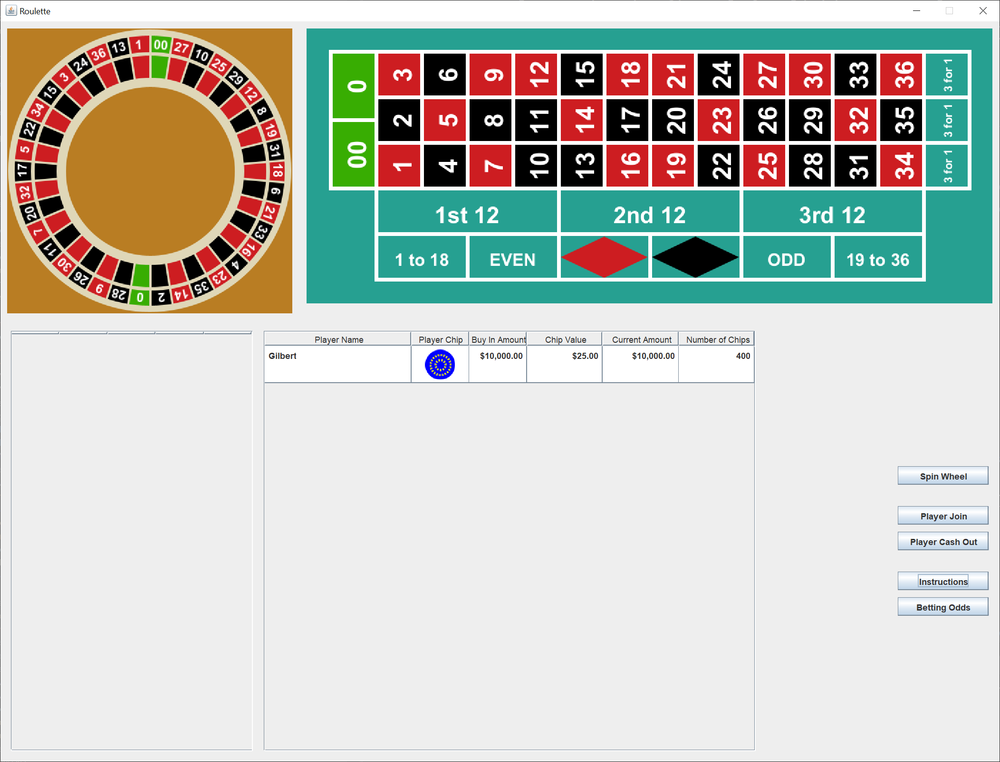
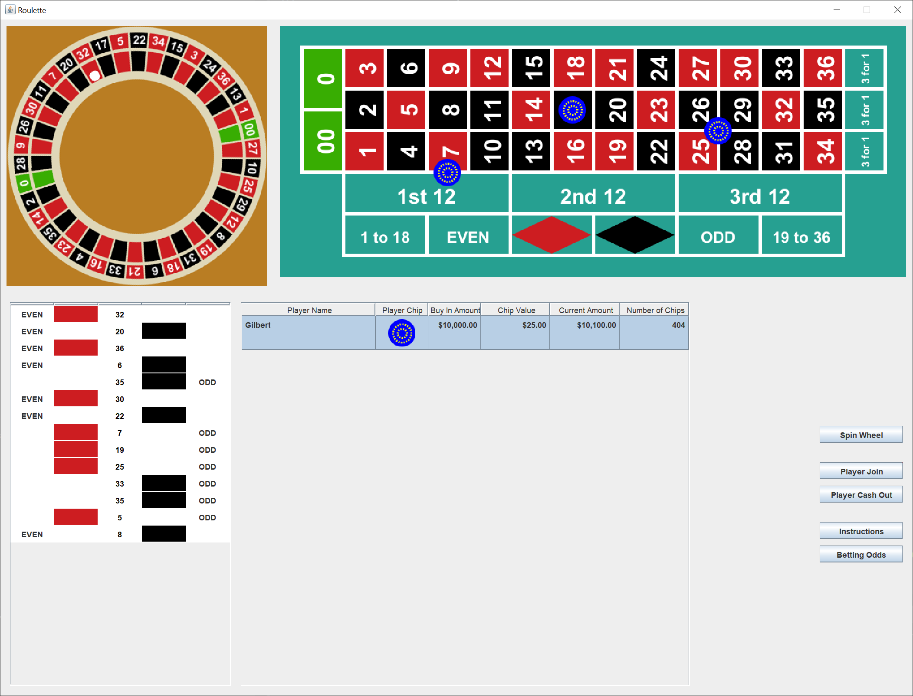
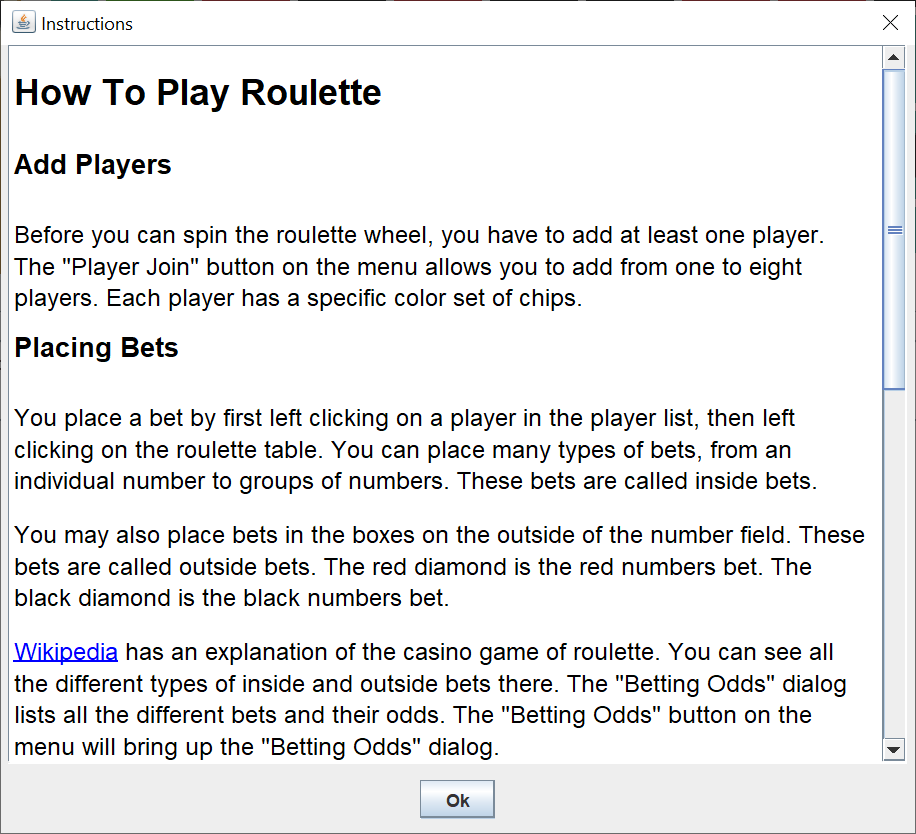

# Roulette

I created a fairly complex Swing GUI with two complex images.  You can enjoy this application as a game, or you can read the technical description to see how the GUI was put together,

Here's what the GUI looks like after you've added a player.

Here's what the GUI looks like after you've spun the roulette wheel a few times and placed three bets on the roulette table.

At the top of the GUI, you have the roulette wheel and the roulette table.  Below them on the left is the roulette wheel spin table.  The spin table records the last 20 spins.  Next is the table of players.  To the right is the button menu.

The "Instruction" button will bring up a instructions dialog explaining how to play the roulette game.  Here's an image of the instructions dialog.

## Add Players

Before you can spin the roulette wheel, you have to add at least one player.  The "Player Join" button on the menu allows you to add from one to eight players.  Each player has a specific color set of chips.

## Placing Bets

You place a bet by first left clicking on a player in the player list, then left clicking on the roulette table.  You can place many types of bets, from an individual number to groups of numbers.  These bets are called inside bets.

You may also place bets in the boxes on the outside of the number field.  These bets are called outside bets.  The red diamond is the red numbers bet.  The black diamond is the black numbers bet.

[Wikipedia](https://en.wikipedia.org/wiki/Roulette) has an explanation of the casino game of roulette. You can see all the different types of inside and outside bets there.  The "Betting Odds" dialog lists all the different bets and their odds.  The "Betting Odds" button on the menu will bring up the "Betting Odds" dialog.

There are different betting limits on inside bets and outside bets.  You must bet a minimum amount each spin and you can't bet more than a maximum amount. The minimum bet amount is $4.  The maximum inside bet is $25.  The maximum outside bet is $200.

To remove a bet, right click on a chip of your chip color.

## Spinning the Roulette Wheel

The roulette wheel is a standard double zero wheel.  Left click the "Spin Wheel" button on the menu.

When the roulette wheel stops, any winning chips will be listed in a "Winners" dialog. After the dialog is closed, the non-winning chips are removed from the roulette table.

A difference between this game and an actual roulette table in a casino is that outside bet winnings are not placed on the outside bet area.  If you wish to increase your bet, just left click on the outside bet area when it's your turn to place bets.

## Leaving the Roulette Table

You can cash out at any time by left clicking the "Player Cash Out" button on the menu.  If you run out of chips, you're busted.
